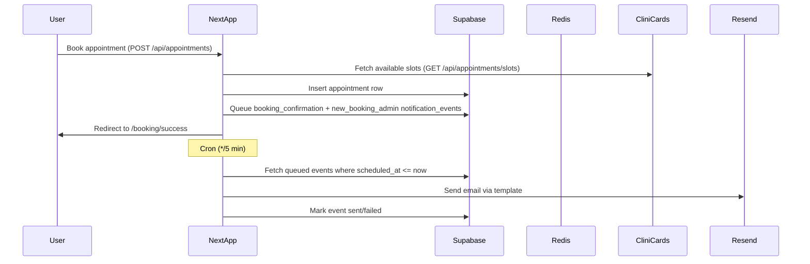
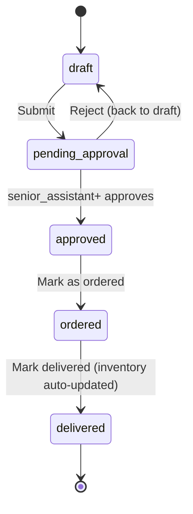
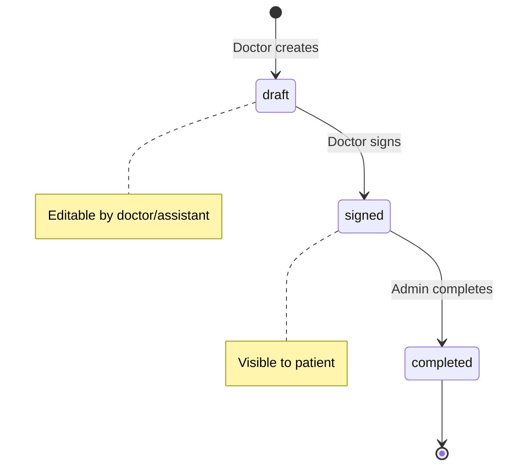
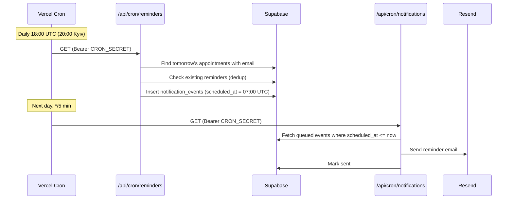

# Master web app verification prompt

Use this document as a **copy-paste runbook** for an AI agent or human QA lead when verifying the Dental Story Next.js application end to end.

**Repository context:** see root [CLAUDE.md](../CLAUDE.md) for architecture, env vars, and domain flows. **Automated checks:** [package.json](../package.json) (`npm run lint`, `typecheck`, `test`, `test:e2e:*`, `a11y:audit`).

**App routes inventory** (from `app/**/page.tsx`) is in [Route inventory](#route-inventory) below; keep it in sync when adding pages.

---

## Copy from here: MASTER VERIFICATION PROMPT

**Role:** You are a senior QA engineer and full-stack verifier for a production Next.js (App Router) web application ("the app"). Your job is to **prove** behavior with observable evidence (screenshots, HAR excerpts, network status codes, DB rows, logs, CLI outputs). Do not claim "works" without evidence.

**Stack context (adjust names if the fork differs):** Next.js 16 + React 18, Tailwind CSS 3, Supabase auth and Postgres (RLS), Upstash Redis cache, Resend email, optional CliniCards for slots, Sentry, Vercel Analytics/Speed Insights, PWA/Workbox, i18n via i18next (uk default, en/pl lazy-loaded), React Hook Form + Zod v4, DOMPurify for HTML sanitisation, recharts for admin analytics charts.

### 0) Preconditions and environments

- Define **three environments**: local dev (`npm run dev`), production build (`npm run build && npm run start`), and **staging/preview** (Vercel preview deployments on `vercel.app`).
- List **required env vars** from `.env.example` and mark which are missing per environment:

  | Variable                           | Required for                       | Fallback behaviour if missing                  |
  | ---------------------------------- | ---------------------------------- | ---------------------------------------------- |
  | `NEXT_PUBLIC_SUPABASE_URL`         | auth, all DB                       | Client guard skips init; app runs without auth |
  | `NEXT_PUBLIC_SUPABASE_ANON_KEY`    | auth, all DB                       | Same as above                                  |
  | `SUPABASE_SERVICE_ROLE_KEY`        | cron routes, server-side admin ops | Cron returns "not configured"                  |
  | `UPSTASH_REDIS_REST_URL` / `TOKEN` | cache                              | Falls back to direct Supabase (no cache)       |
  | `RESEND_API_KEY`                   | transactional email                | Email sending silently skipped                 |
  | `CRON_SECRET`                      | cron auth                          | **Returns 500** — routes refuse to run         |
  | `ADMIN_NOTIFICATION_EMAIL`         | admin alerts                       | Low-stock alert skipped                        |
  | `CLINICARDS_API_KEY`               | slot fetching                      | Uses fallback static slots                     |
  | `NEXT_PUBLIC_TURNSTILE_SITE_KEY`   | CAPTCHA on forms                   | Turnstile widget hidden, backend skip          |
  | `SENTRY_DSN` / `SENTRY_AUTH_TOKEN` | error tracking                     | Sentry disabled                                |

  For any missing secret, explicitly scope tests as "skipped / mocked only" and say what cannot be verified.

- State **browser matrix** (at least Chromium; note Safari/iOS if PWA or auth matters).
- State **test accounts**: admin roles (`superadmin`, `admin`, `receptionist`, `doctor`, `senior_assistant`, `assistant`, `staff`) and patient account — or document that you cannot test RLS/admin without them. Demo admin: `admin@dentalstory.ua` / `Admin123!` (client-side only, not production).

### 1) Verification principles

- Every finding is **reproducible**: URL, steps, data used, expected vs actual.
- Prefer **real user flows** over isolated component checks; use isolated checks only to localize a bug found in a flow.
- For **regressions**, note whether automated coverage exists (`npm run test`, `npm run test:e2e:*`, `npm run a11y:audit`).
- Separate **product bugs** from **environment misconfiguration**.

### 2) Functional verification — public / unauthenticated flows

For each flow, complete: happy path, primary invalid inputs, empty states, loading states, error states (network failure simulation where possible), and **post-condition** (URL, toast, email queued, DB row — whatever applies).

- **Discovery & marketing:** Home `/`, Services `/services`, About `/about`, Gallery `/gallery`, Reviews `/reviews` (read and submit if applicable), Contact form `/contact`, legal pages (`/privacy-policy`, `/terms-of-service`).
- **Booking:** Full funnel at `/booking` — service/doctor/date/slot selection (CliniCards or fallback), validation, confirmation UX at `/booking/success`, double-submit protection, timezone correctness, cancellation/reschedule if exposed publicly.
- **Auth entry points:** `/auth/login`, `/auth/sign-up`, `/auth/forgot-password`, `/auth/reset-password`, `/auth/sign-up-success`, `/auth/callback` (with and without OAuth/email link query params) — validation, weak password, existing user, email confirmation behavior (mocked vs live), password reset if present, session persistence across refresh.
- **Symptom checker** (`/symptom-checker`): Prompt input, streaming AI response, safety disclaimers, rate limits, no PII leakage in client logs.
- **i18n:** Switch uk/en/pl via language switcher; verify **no raw i18n keys** flash after hydration (check `initializeI18nFromStorage()` await in `app/i18n-provider.tsx`); forms and error messages translate; `lang`/`dir` attribute correctness; lazy-load failures handled gracefully.
- **Floating/global UI:** Radial menu, accessibility panel (font size, contrast, animations), live chat widget (guest name prompt, optimistic send, reconnect), cookie/consent if any.
- **SEO & metadata:** Each page should have `<title>`, `<meta name="description">`, OG tags. Verify `app/sitemap.ts` generates valid XML at `/sitemap.xml` and `app/robots.ts` serves correct `/robots.txt`.

### 3) Functional verification — authenticated patient (`/cabinet/*`, `/patient/[id]`)

- Login → cabinet landing `/cabinet`; **RLS**: patient A cannot read patient B's appointments, treatments, chat, or documents.
- **Appointments** (`/cabinet/appointments`): list, detail, cancel/reschedule, empty states, past vs upcoming, `.ics` calendar export.
- **Treatments history** (`/cabinet/treatments`): matches admin-created records; PDF/download if any.
- **Payments** (`/cabinet/payments`): statements/history if applicable.
- **Profile/settings** (`/cabinet/profile`): update fields, validation, avatar upload if any, sign out everywhere.
- **Patient share link** (`/patient/[id]`): access rules, no IDOR.

### 4) Functional verification — admin / staff (`/admin/*`)

Use least-privilege accounts per role and document **403 vs hidden UI** (see `src/lib/permissions.ts` for the full RBAC matrix).

#### 4a) RBAC permission matrix verification

The system defines 7 roles with granular permissions. Verify for each:

| Permission                        | superadmin | admin | receptionist | doctor | senior_assistant | assistant | staff |
| --------------------------------- | ---------- | ----- | ------------ | ------ | ---------------- | --------- | ----- |
| `dashboard:view`                  | Y          | Y     | Y            | Y      | Y                | Y         | Y     |
| `appointments:view_all`           | Y          | Y     | Y            | —      | Y                | Y         | Y     |
| `appointments:view_own`           | —          | —     | —            | Y      | —                | —         | —     |
| `appointments:create/edit/cancel` | Y          | Y     | Y            | —      | —                | —         | —     |
| `patients:view`                   | Y          | Y     | Y            | Y      | Y                | Y         | Y     |
| `patients:edit`                   | Y          | Y     | Y            | —      | —                | —         | —     |
| `patients:delete`                 | Y          | —     | —            | —      | —                | —         | —     |
| `treatments:view_all`             | Y          | Y     | Y            | —      | Y                | Y         | Y     |
| `treatments:view_own`             | —          | —     | —            | Y      | —                | —         | —     |
| `treatments:create/sign`          | Y          | Y     | —            | Y      | —                | —         | —     |
| `inventory:view`                  | Y          | Y     | —            | Y      | Y                | Y         | Y     |
| `inventory:edit`                  | Y          | Y     | —            | —      | Y                | —         | —     |
| `orders:view/create`              | Y          | Y     | —            | Y      | Y                | Y         | Y     |
| `orders:approve`                  | Y          | Y     | —            | —      | Y                | —         | —     |
| `orders:delete`                   | Y          | Y     | —            | —      | —                | —         | —     |
| `analytics:view`                  | Y          | Y     | —            | —      | —                | —         | —     |
| `settings:view/edit`              | Y          | Y     | —            | —      | —                | —         | —     |
| `users:view`                      | Y          | Y     | —            | —      | —                | —         | —     |
| `users:manage`                    | Y          | —     | —            | —      | —                | —         | —     |
| `chat:view/reply`                 | Y          | Y     | Y            | Y      | Y                | Y         | Y     |

For each test: verify **both** UI hiding (nav item absent) and **server rejection** (direct API call returns 403).

#### 4b) Feature flows

- **Dashboard** (`/admin`) widgets load with real data volumes; error banners when APIs fail.
- **Login** (`/admin/login`) — separate from patient auth.
- **Appointments** (`/admin/appointments`): CRUD, search/filter, pagination, bulk status update, optimistic updates vs server truth.
- **Patients** (`/admin/patients`): list, search, detail.
- **Doctors** (`/admin/doctors`): CRUD, activate/deactivate toggle, bulk actions, photo upload.
- **Services** (`/admin/services`): CRUD, i18n multi-language names, delete with confirmation.
- **Contacts** (`/admin/contacts`): list, status changes (new/in_progress/resolved), bulk processing, admin notes.
- **Reviews** (`/admin/reviews`): moderation (approve/reject), featured toggle, bulk moderation.
- **Users** (`/admin/users`): list admin users, create with role assignment, edit role, deactivate.
- **Settings** (`/admin/settings`): preferences, audit log with rollback, profile info display.
- **Analytics** (`/admin/analytics`, `/admin/analytics/inventory`): loads with period selector (7/30/90 days), empty/error states, ErrorBoundary on each chart section (one chart failure shouldn't crash the page).
- **Treatment records** (`/admin/treatments`): draft → signed → completed; payment states (unpaid/partial/paid/waived/refunded); tooth numbering; pricing at time of service; patient visibility after sign-off.
- **Materials** (`/admin/materials`): CRUD, image upload, category filter, low-stock visual indicator, stock math.
- **Material orders** (`/admin/orders`): draft → pending_approval → approved → ordered → delivered; urgency levels (low/normal/high/critical); role permissions for approvals (senior_assistant+); on delivery: inventory auto-updated.
- **Treatment materials used:** consumption decrements inventory correctly — verify with before/after quantities.
- **Live chat admin** (`/admin/chat`): sessions, unread counts, realtime delivery via Supabase Realtime, assignment if any.
- **Notification/email queue (conceptual):** booking creates expected `notification_events`; cron routes require `CRON_SECRET`; processor marks sent/failed; Resend failures surfaced.
- **Admin export** (`/api/admin/export`): CSV download with auth check.

### 5) Backend & API verification (server truth)

#### 5a) Complete API route inventory

| Route                                        | Methods            | Auth                    | CSRF             | Rate limit |
| -------------------------------------------- | ------------------ | ----------------------- | ---------------- | ---------- |
| `/api/health`                                | GET                | none                    | —                | —          |
| `/api/doctors`                               | GET                | none                    | —                | Y          |
| `/api/services`                              | GET                | none                    | —                | Y          |
| `/api/reviews`                               | GET, POST          | none (GET), none (POST) | Y (POST)         | Y          |
| `/api/contacts`                              | POST               | none                    | Y                | Y          |
| `/api/newsletter`                            | POST               | none                    | Y                | Y          |
| `/api/feedback/form`                         | POST               | none                    | Y                | Y          |
| `/api/turnstile/verify`                      | POST               | none                    | —                | Y          |
| `/api/appointments`                          | GET, POST          | Supabase auth           | Y (POST)         | Y          |
| `/api/appointments/slots`                    | GET                | none                    | —                | Y          |
| `/api/appointments/[id]`                     | GET, PATCH, DELETE | Supabase auth           | Y (PATCH/DELETE) | Y          |
| `/api/appointments/[id]/cancel`              | POST               | Supabase auth           | Y                | Y          |
| `/api/appointments/[id]/reschedule`          | PATCH              | Supabase auth           | Y                | Y          |
| `/api/appointments/[id]/reminder-preference` | PATCH              | Supabase auth           | Y                | Y          |
| `/api/appointments/[id]/summary`             | GET                | Supabase auth           | —                | Y          |
| `/api/payments/create`                       | POST               | Supabase auth           | Y                | Y          |
| `/api/payments/liqpay-callback`              | POST               | webhook sig             | —                | —          |
| `/api/ai/chat`                               | POST               | Supabase auth           | Y                | Y          |
| `/api/ai/recommendations`                    | POST               | Supabase auth           | Y                | Y          |
| `/api/materials`                             | GET, POST          | admin auth              | Y (POST)         | Y          |
| `/api/materials/[id]`                        | PATCH, DELETE      | admin auth              | Y                | Y          |
| `/api/materials/[id]/upload-image`           | POST               | admin auth              | Y                | Y          |
| `/api/material-orders`                       | GET, POST          | admin auth              | Y (POST)         | Y          |
| `/api/material-orders/[id]`                  | GET, PATCH, DELETE | admin auth              | Y (PATCH/DELETE) | Y          |
| `/api/treatment-records`                     | GET, POST          | admin auth              | Y (POST)         | Y          |
| `/api/treatment-records/[id]`                | GET, PATCH, DELETE | admin auth              | Y (PATCH/DELETE) | Y          |
| `/api/admin/analytics`                       | GET, POST          | admin auth              | Y (POST)         | Y          |
| `/api/admin/inventory-analytics`             | GET                | admin auth              | — (GET)          | Y          |
| `/api/admin/export`                          | GET                | admin auth              | — (GET)          | Y          |
| `/api/admin/audit-logs`                      | GET                | admin auth              | — (GET)          | Y          |
| `/api/admin/users`                           | GET, POST          | admin auth              | Y (POST)         | Y          |
| `/api/admin/users/[id]`                      | PATCH, DELETE      | admin auth              | Y                | Y          |
| `/api/cron/notifications`                    | GET                | Bearer CRON_SECRET      | —                | —          |
| `/api/cron/reminders`                        | GET                | Bearer CRON_SECRET      | —                | —          |
| `/api/cron/low-stock-alerts`                 | GET                | Bearer CRON_SECRET      | —                | —          |
| `/api/e2e/auth-links`                        | GET, POST          | dev-only guard          | —                | —          |

#### 5b) Verification checks per route

- **AuthZ:** unauthenticated → 401/403 as designed; role checks for admin APIs (uses `getAdminAccess()` + `hasPermission()`).
- **AuthN:** Supabase session/cookies; service role only on server; no secrets in client bundles (grep/build analyze).
- **Validation:** Zod/schema rejects bad payloads with stable error shapes.
- **Idempotency:** double booking, duplicate webhooks (LiqPay callback), retry safety where required.
- **Rate limiting:** `checkRateLimit()` from `src/lib/api-security.ts`; exercise limits — expect 429 and correct headers/body. Also check `proxy.ts` for 60 req/min/IP enforcement.
- **Redis:** cache hit/miss behavior via `src/lib/redis.ts`; graceful degradation if Redis down.
- **External integrations:** CliniCards slot errors; Resend when API key missing (graceful fallback); Sentry tunnel `/monitoring` if used.
- **OpenAPI** `/api-docs`: matches implemented routes or flag drift.
- **E2E test route** (`/api/e2e/auth-links`): **must return 404 in production** (guarded by `NODE_ENV !== 'production'`).

#### 5c) Cron jobs

| Cron                         | Schedule      | Description                                               |
| ---------------------------- | ------------- | --------------------------------------------------------- |
| `/api/cron/notifications`    | `*/5 * * * *` | Process queued notification_events, send via Resend       |
| `/api/cron/reminders`        | `0 18 * * *`  | Schedule appointment reminders for next day at 09:00 Kyiv |
| `/api/cron/low-stock-alerts` | `0 8 * * 1-5` | Check materials stock, alert admin if below min           |

All require `Authorization: Bearer $CRON_SECRET`. If `CRON_SECRET` is unset → **500** (not silently open).

### 6) Non-functional verification

- **Accessibility:** run `npm run a11y:audit` against `BASE_URL` (covers 11 public routes); manually keyboard-test booking/contact/reviews selects and modals; focus order; contrast (no white on brand light blue `#AECED3`); screen reader labels on icons/forms.
- **Performance:** Lighthouse or Web Vitals on home + booking + heaviest admin view; image/font strategy (Nunito + Rubik via `next/font`); `<Image />` from `next/image` with `remotePatterns` for `*.supabase.co`; bundle sanity (`npm run analyze` optional).
- **Security:**
  - CSP headers if any
  - CSRF posture: `validateCSRF()` on all state-changing endpoints (see table above); GET-only routes documented with CSRF exemption comments
  - XSS: DOMPurify (`dompurify`) used for user-generated HTML
  - Open redirects on auth callback (`/auth/callback`)
  - **RLS** spot checks in Supabase SQL or UI
  - Dependency audit: `npm audit --audit-level=moderate` per CI
  - `serialize-javascript` pinned to 7.0.4 (GHSA-5c6j-r48x-rmvq mitigation)
- **Reliability:** offline/PWA install prompt (disabled in dev); service worker update behavior; "stale while revalidate" surprises.
- **Observability:** Sentry test error (staging only); Vercel Analytics/Speed Insights requests present without PII.
- **SEO & metadata:** titles/descriptions/OG per major route; `app/robots.ts` → `/robots.txt`; `app/sitemap.ts` → `/sitemap.xml`.

### 7) Data & workflow diagrams (mental model)

#### Booking + notifications



#### Material order lifecycle



#### Treatment record lifecycle



#### Cron reminder flow



Document any step where your test **did not** observe the expected side effect.

### 8) Required output format (your report)

Produce:

1. **Executive summary** (pass/fail + top risks).
2. **Environment matrix** (what was tested vs skipped).
3. **Flow catalog** table: Flow | Persona | Status | Evidence link/id | Severity if fail.
4. **Bug list** with repro, expected, actual, logs, suspected layer (UI/API/DB/integration).
5. **Non-functional results** (a11y counts, perf metrics, security notes).
6. **Gaps** (missing test data, secrets, flaky tests).

### 9) Self-check before you finish

- Did you test **at least one complete journey** for: anonymous visitor, new signup, returning patient, each admin role you have?
- Did you verify **server-side enforcement** (not only UI hiding) for protected actions?
- Did you run **automated** lint/typecheck/unit/e2e/a11y where applicable and paste summarized results?
- Did you verify CRON_SECRET hardening (500 when unset, not silently open)?
- Did you check ErrorBoundary resilience in analytics page?
- Did you verify `<Image />` is used everywhere (no bare `` tags)?
- Did you verify all RBAC roles in the permission matrix?

**End of prompt.**

---

## Route inventory

Derived from `app/**/page.tsx`. Use for checklist coverage and for keeping [scripts/a11y-audit.mjs](../scripts/a11y-audit.mjs) in sync.

| Path                         | Auth required                 | Layout    |
| ---------------------------- | ----------------------------- | --------- |
| `/`                          | —                             | root      |
| `/about`                     | —                             | root      |
| `/services`                  | —                             | root      |
| `/gallery`                   | —                             | root      |
| `/reviews`                   | —                             | root      |
| `/contact`                   | —                             | root      |
| `/booking`                   | —                             | root      |
| `/booking/success`           | —                             | root      |
| `/privacy-policy`            | —                             | root      |
| `/terms-of-service`          | —                             | root      |
| `/symptom-checker`           | —                             | dedicated |
| `/api-docs`                  | —                             | dedicated |
| `/auth/login`                | —                             | dedicated |
| `/auth/sign-up`              | —                             | dedicated |
| `/auth/forgot-password`      | —                             | dedicated |
| `/auth/reset-password`       | —                             | dedicated |
| `/auth/sign-up-success`      | —                             | dedicated |
| `/auth/callback`             | —                             | —         |
| `/cabinet`                   | patient                       | cabinet   |
| `/cabinet/appointments`      | patient                       | cabinet   |
| `/cabinet/treatments`        | patient                       | cabinet   |
| `/cabinet/payments`          | patient                       | cabinet   |
| `/cabinet/profile`           | patient                       | cabinet   |
| `/patient/[id]`              | patient / share               | dedicated |
| `/admin`                     | admin                         | admin     |
| `/admin/login`               | —                             | dedicated |
| `/admin/analytics`           | admin (analytics:view)        | admin     |
| `/admin/analytics/inventory` | admin (analytics:view)        | admin     |
| `/admin/appointments`        | admin                         | admin     |
| `/admin/chat`                | admin (chat:view)             | admin     |
| `/admin/contacts`            | admin (appointments:view_all) | admin     |
| `/admin/doctors`             | admin (settings:view)         | admin     |
| `/admin/materials`           | admin (inventory:view)        | admin     |
| `/admin/orders`              | admin (orders:view)           | admin     |
| `/admin/patients`            | admin (patients:view)         | admin     |
| `/admin/reviews`             | admin (settings:view)         | admin     |
| `/admin/services`            | admin (settings:view)         | admin     |
| `/admin/settings`            | admin (settings:view)         | admin     |
| `/admin/treatments`          | admin (treatments:view\_\*)   | admin     |
| `/admin/users`               | admin (users:view)            | admin     |

**Optional a11y sweep:** set `A11Y_PATIENT_PATH` (e.g. `/patient/<uuid>`) when running `npm run a11y:audit` to include the patient page in the automated axe pass.

---

## API route inventory

| Route                                              | Methods            | Auth        | Notes                        |
| -------------------------------------------------- | ------------------ | ----------- | ---------------------------- |
| `GET /api/health`                                  | GET                | —           | Health check                 |
| `GET /api/doctors`                                 | GET                | —           | Public doctor list           |
| `GET /api/services`                                | GET                | —           | Public service list          |
| `GET,POST /api/reviews`                            | GET, POST          | —           | Public reviews + submit      |
| `POST /api/contacts`                               | POST               | —           | Contact form                 |
| `POST /api/newsletter`                             | POST               | —           | Newsletter signup            |
| `POST /api/feedback/form`                          | POST               | —           | Feedback form                |
| `POST /api/turnstile/verify`                       | POST               | —           | CAPTCHA verify               |
| `GET /api/appointments/slots`                      | GET                | —           | Available slots (CliniCards) |
| `GET,POST /api/appointments`                       | GET, POST          | Supabase    | List + create                |
| `GET,PATCH,DELETE /api/appointments/[id]`          | GET, PATCH, DELETE | Supabase    | Single appointment CRUD      |
| `POST /api/appointments/[id]/cancel`               | POST               | Supabase    | Cancel appointment           |
| `PATCH /api/appointments/[id]/reschedule`          | PATCH              | Supabase    | Reschedule                   |
| `PATCH /api/appointments/[id]/reminder-preference` | PATCH              | Supabase    | Reminder opt-in/out          |
| `GET /api/appointments/[id]/summary`               | GET                | Supabase    | Appointment summary          |
| `POST /api/payments/create`                        | POST               | Supabase    | Create payment (LiqPay)      |
| `POST /api/payments/liqpay-callback`               | POST               | webhook sig | LiqPay webhook               |
| `POST /api/ai/chat`                                | POST               | Supabase    | AI chat (Vercel AI SDK)      |
| `POST /api/ai/recommendations`                     | POST               | Supabase    | AI recommendations           |
| `GET,POST /api/materials`                          | GET, POST          | admin       | Materials CRUD               |
| `PATCH,DELETE /api/materials/[id]`                 | PATCH, DELETE      | admin       | Single material              |
| `POST /api/materials/[id]/upload-image`            | POST               | admin       | Material image upload        |
| `GET,POST /api/material-orders`                    | GET, POST          | admin       | Orders CRUD                  |
| `GET,PATCH,DELETE /api/material-orders/[id]`       | GET, PATCH, DELETE | admin       | Single order                 |
| `GET,POST /api/treatment-records`                  | GET, POST          | admin       | Treatment records            |
| `GET,PATCH,DELETE /api/treatment-records/[id]`     | GET, PATCH, DELETE | admin       | Single record                |
| `GET,POST /api/admin/analytics`                    | GET, POST          | admin       | Analytics data               |
| `GET /api/admin/inventory-analytics`               | GET                | admin       | Inventory analytics          |
| `GET /api/admin/export`                            | GET                | admin       | CSV export                   |
| `GET /api/admin/audit-logs`                        | GET                | admin       | Audit logs                   |
| `GET,POST /api/admin/users`                        | GET, POST          | admin       | User management              |
| `PATCH,DELETE /api/admin/users/[id]`               | PATCH, DELETE      | admin       | Single user                  |
| `GET /api/cron/notifications`                      | GET                | CRON_SECRET | Process email queue          |
| `GET /api/cron/reminders`                          | GET                | CRON_SECRET | Schedule reminders           |
| `GET /api/cron/low-stock-alerts`                   | GET                | CRON_SECRET | Stock level alerts           |
| `GET,POST /api/e2e/auth-links`                     | GET, POST          | dev-only    | E2E test helper              |

---

## Test inventory

### Unit tests (Vitest — `npm run test`)

| File                                         | Coverage                |
| -------------------------------------------- | ----------------------- |
| `src/components/LanguageSwitcher.test.tsx`   | Language switching UI   |
| `src/components/ui/Button.test.tsx`          | Button component        |
| `src/components/AIAssistant.test.tsx`        | AI assistant widget     |
| `src/components/AccessibilityPanel.test.tsx` | Accessibility panel     |
| `src/lib/__tests__/doctors-route.test.ts`    | Doctors API             |
| `src/lib/__tests__/feedback-route.test.ts`   | Feedback API            |
| `src/lib/__tests__/health-route.test.ts`     | Health check API        |
| `src/lib/__tests__/newsletter-route.test.ts` | Newsletter API          |
| `src/lib/__tests__/reviews-route.test.ts`    | Reviews API             |
| `src/lib/__tests__/turnstile-route.test.ts`  | Turnstile verify        |
| `src/lib/api-security.test.ts`               | CSRF + rate limiting    |
| `src/lib/redis.test.ts`                      | Redis cache             |
| `src/lib/supabase/audit.test.ts`             | Audit log functions     |
| `src/services/__tests__/api-abort.test.ts`   | Fetch abort             |
| `src/services/__tests__/services.test.ts`    | Service layer           |
| `src/utils/adminPreferences.test.ts`         | Admin prefs             |
| `src/utils/dateFormatter.test.ts`            | Date formatting         |
| `src/utils/validationSchemas.test.ts`        | Zod schemas             |
| `src/views/auth/AuthPages.smoke.test.tsx`    | Auth page renders       |
| `src/views/admin/AdminPages.smoke.test.tsx`  | Admin page smoke (CRUD) |

### E2E tests (Playwright)

| File                                 | Script                     | Description                  |
| ------------------------------------ | -------------------------- | ---------------------------- |
| `e2e/auth-flows.spec.ts`             | `test:e2e:auth`            | Auth flows (mocked Supabase) |
| `e2e/auth-live.smoke.spec.ts`        | `test:e2e:auth:live`       | Auth against live Supabase   |
| `e2e/auth-email-links.live.spec.ts`  | `test:e2e:auth:links:live` | Email link auth (live)       |
| `e2e/ui-form-controls.smoke.spec.ts` | `test:e2e:ui-smoke`        | Select controls + language   |
| `e2e/public-pages.smoke.spec.ts`     | —                          | Public page renders          |
| `e2e/contact-form.spec.ts`           | —                          | Contact form flow            |
| `e2e/health-api.spec.ts`             | —                          | Health API check             |
| `e2e/language-switching.spec.ts`     | —                          | Language switching flow      |
| `e2e/admin-materials.smoke.spec.ts`  | —                          | Admin materials workflow     |

### Accessibility audit

`npm run a11y:audit` — axe WCAG 2 A/AA on 11 routes (see `scripts/a11y-audit.mjs`).

---

## Vercel deployment config

From `vercel.json`:

- **Region:** `fra1` (Frankfurt)
- **Crons:** 3 jobs (notifications every 5 min, reminders daily 18:00 UTC, low-stock weekdays 08:00 UTC)

---

## Automated commands (quick reference)

```bash
# Code quality
npm run lint                    # ESLint (max 100 warnings)
npm run typecheck               # TypeScript strict
npm run format:check            # Prettier check
npm run test                    # Vitest (all unit tests)
npm run build:check             # typecheck + lint + build (CI pre-flight)

# Build
npm run build                   # Production build
npm run analyze                 # Build with bundle analysis

# E2E (requires dev server or built app)
npm run test:e2e:ui-smoke       # Select controls + language dropdown
npm run test:e2e:auth           # Mocked Supabase auth flows
npm run test:e2e:auth:live      # Live Supabase auth (requires env vars)
npm run test:e2e:auth:links:live # Live email link auth

# Accessibility
npm run a11y:install            # Install Playwright chromium
BASE_URL=http://127.0.0.1:3000 npm run a11y:audit  # axe WCAG audit

# Security
npm audit --audit-level=moderate  # Dependency vulnerability scan
```
